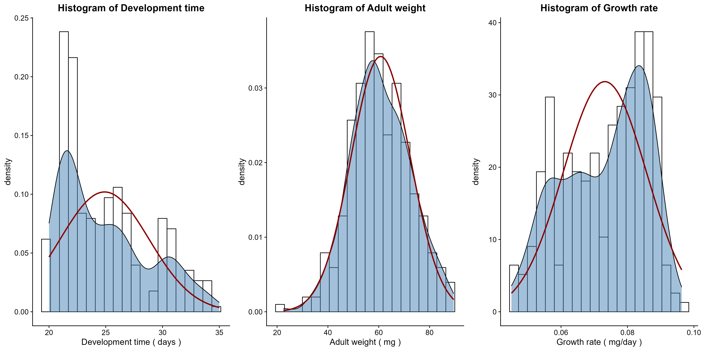
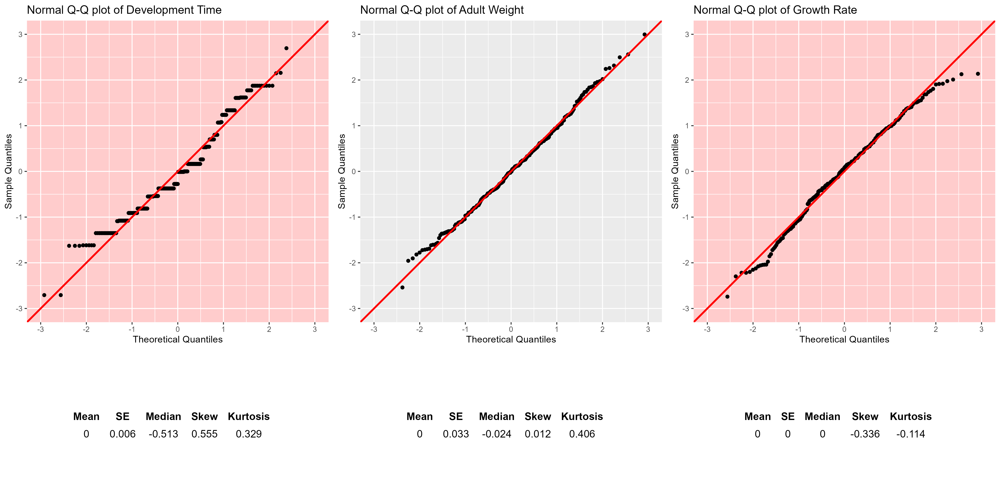
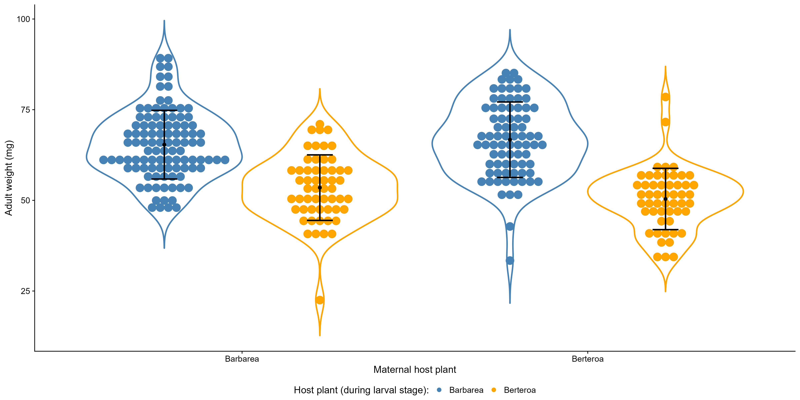

```{r setup, include=FALSE}
knitr::opts_chunk$set(echo = TRUE)
options(scipen = 2)
```

## Introduction

Analysis of Variance (ANOVA) is a powerful statistical technique used to examine the differences between multiple groups or treatments and determine whether those differences are statistically significant. ANOVA is particularly valuable when you want to compare means across more than two groups, making it a versatile tool in various fields, including psychology, biology, business, and more. In this exercise, I apply ANOVA to a real-world data set to explore the sources of variation on the growth of a butterfly species. In this case the possible contributors are the plant hosts that were available at different stages of the life cycle of the butterfly. 

```{r echo = F}
head(data)
```
## Methods

### Normality of the data

ANOVA assumes that the data is normally distributed, thus I used the Shapiro-Wilk test to determine whether the three possible response variables: the 'development time', the 'growth rate' and the 'adult weight' follow a normal distribution or not.  This statistical test assesses the null hypothesis that the data is normally distributed. If the p-value from the test is less than the chosen significance level (0.05), the null hypothesis can be rejected, indicating that the data significantly deviates from a normal distribution. The test was run on the residues from the mixed-effect linear model regression `lm(DevelopmentTime ~ LarvalHost * MaternalHost, data = data, na.action = na.exclude)`. I have go the standardized residues from the model using `rstandard()`, then used `saphiro.test()` function to perform the test. It's important to note that the Shapiro-Wilk test is most suitable for relatively small sample sizes (typically less than 50 observations). For larger data sets, the test can become overly sensitive and may detect minor deviations from normality that are not practically significant. Hence, two visual methods were also included assessing the normality alongside the formal statistical test. Histograms were created for each response variable and Q-Q (quantile-quantile) plots were drawn on the residues.

### Homogeneity of variance

The ANOVA also assumes homogeneity of variance, which means that the variance among the groups should be approximately equal. Levene’s test was used to check if the variances whether the response variables obtained for the four groups are equal or not.  when data comes from a non-normal distribution. Levene’s test was used to check the null hypothesis that the population variances are equal, also known as homoscedastic. 

### Analysis of variances

Analysis of Variance (ANOVA) was used to analyze and compare the means of the distinct groups, to test whether there are statistically significant differences between them. In this case two-way ANOVA was employed to analyze the two independent variables - 'larval host plants' and 'maternal host plants' - and their interaction. ANOVA generates an F-statistic, which measures the ratio of between-group variance (MSB) to within-group variance (MSW) - $F = \frac{MSB}{MSW}$, where:

:::::::::::::: {.columns}
::: {.column width="50%"}
$$
MSB = \frac{\sum_{j=1}^{k} n_j (\bar{y}_j - \bar{y})^2}{K - 1}
$$

where:

- $k$ is the number of groups,
- $n_j$ is the sample size of the j-th group,
- $\bar{y}_j$ is the mean of the j-th group,
- $\bar{y}$ is the overall mean.
- and $K$ is the number of groups
:::
::: {.column width="50%"}
$$
MSW = \frac{\sum_{i=1}^{n} (y_{ij} - \bar{y}_j)^2}{N - 1}
$$

where:

- $n$ is the total number of observations,
- $y_{ij}$ is an individual data point in the j-th group,
- $\bar{y}_j$ is the mean of the j-th group.
- and $N$ is the total number of data points.
:::
::::::::::::::


### Understanding the results of the ANOVA analysis

The summary of the ANOVA output doesn’t provide information about which specific groups differ from each other. Tukey’s Honestly Significant Difference (HSD) post-hoc test was used to determine the pairwise differences and to reveal which identify which group comparisons are responsible for these differences. The interpretation of the results of the Tukey's HSD test two select the response variable with the biggest effect size. 

## Results

### 1.) Only the adult weight of the butterflies is suitable for ANOVA

Both the Shapiro-Wilk test and Levene's test showed that the two response variables: 'development time' and 'growth rate' do not satisfy the criteria for ANOVA analysis (p-values: p=`r scientific(norm1$p.value,2)` and p=`r scientific(norm3$p.value,2)`, and p=`r scientific(var1[['Pr(>F)']][1],2)` and p=`r scientific(var3[['Pr(>F)']][1],2)`, respectively). The violation of the normality of the data can be seen on both the histograms (fig 1.) and the Q-Q plots (fig 2.), the resulting lines showed discrete distribution with positive skew and negative skew alongside with truncation, respectively. For these non-normally distributed data a non-parametric test, such as the Kruskal-Wallis or Friedman tests, could have been used. Additionally, violation to the homogeneity of variances, could have been mitigated using a Welch ANOVA, however, both of these methods fall outside of the scope of the current analysis. Only the response variable 'adult weight' passed both the Shapiro-Wilk and Levene's tests (p=`r scientific(norm2$p.value,2)` and p=`r scientific(var2[['Pr(>F)']][1],2)`, respsectively), hence it was used during the further analysis steps.





\n

### 2.) The larval host plant alone determines the adult weight of the butterflies

The ANOVA results suggest that there is a significant difference between the groups and the post-hoc test showed that the variance mainly depends on the larval host plant. 
```{r echo=F}
options(scipen = 1, digits = 2)
posthoc
```
The ANOVA (`formula: AdultWeight ~ MaternalHost * LarvalHost`) suggests that the effect of the maternal host is statistically not significant and very small (F(1, 283) = 0.82, p = 0.366, Eta2 (partial) = 2.89e-03), so is the interaction between maternal host and larval host (F(1, 283) = 3.75, p = 0.054, Eta2 (partial) = 0.01), however, the effect of larval host is statistically significant and large (F(1, 283) = 144.89, p < .001, Eta2 (partial) = 0.34). The ANOVA results showed that the combined effect of the maternal- and larval host plants is responsible for the `r paste(round(summary(lm2)$r.squared*100,2),"%")` of the total variation that was observable in the weight of the adult butterflies. However,  type of the plant that the larvae fed on alone was responsible for `r paste(ETA_LarvalHost,"%")` of this effect. It can be concluded that the most important factor on the growth of the butterfly is the host plant during the larval phase of their life cycle.




